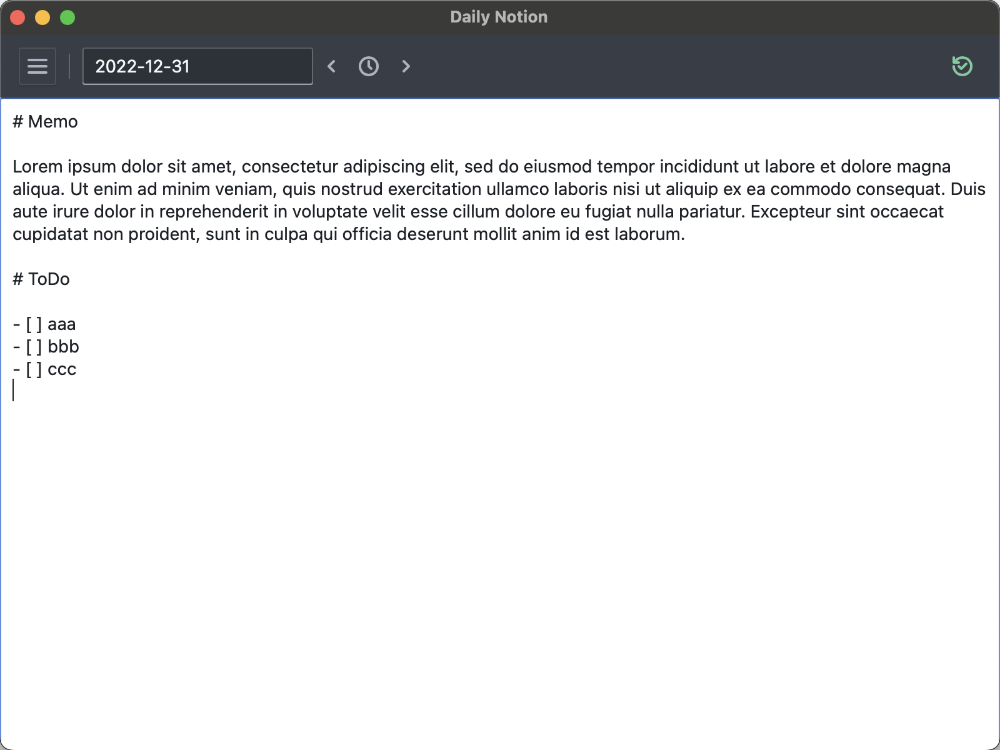
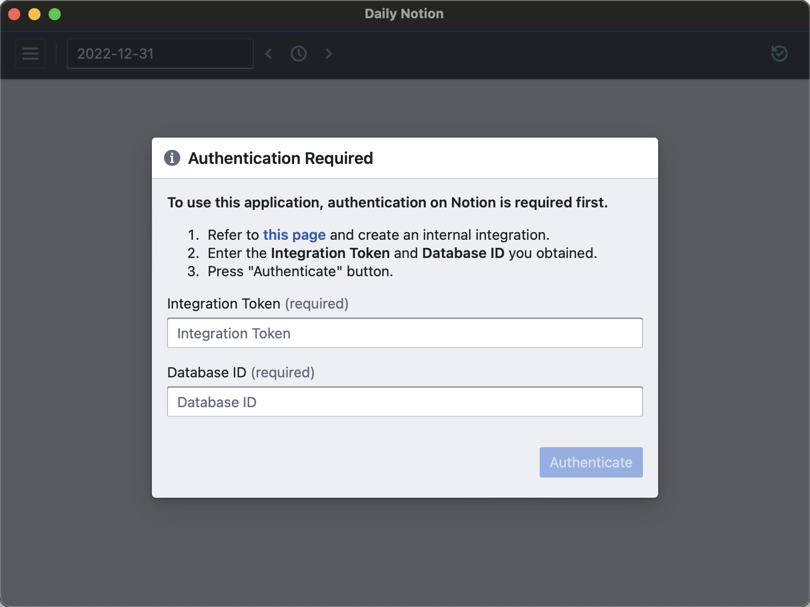

# Daily Notion

A simple daily notes application using Notion API

Screenshot of the main screen:

GIF video of the main screen (Left window. Notice the real-time saving in Notion on the right):

## Features

- You can start taking notes as soon as you open the application.
- Real-time saving to Notion automatically.
- Create / Load pages automatically for each date.

Note: Currently, it is under development. and only "sort-of usable" level functions have been implemented.

## Usage

日本語での詳細な使い方は[こちら](https://zenn.dev/hg/articles/dd9399406f04da)をご覧下さい。  
For detailed instructions in Japanese, please see [here](https://zenn.dev/hg/articles/dd9399406f04da).

### 1. Install (for non-developers)

Installers for each OS (Windows, macOS, Linux) are available [here](https://github.com/h1g0/daily-notion/releases).

### 2. Authentication on Notion

When the program is launched for the first time, a dialog box will appear asking for authentication.

Please refer to [this page](https://developers.notion.com/docs/create-a-notion-integration) to create an integration in your Notion working space.

After you get an integration token and a database ID, enter them and press the "Authentication" button.

### 3. Taking notes

Enjoy.

- The notes you write will be saved automatically.
- The location of the notes is the database you have selected in Notion.
- Saved on a page titled with a date in the format "YY-MM-DD".

## For developers

Any contributions are welcome!

This application is built with the following structure:

- [Rust](https://www.rust-lang.org)
- [TypeScript](https://www.typescriptlang.org)
- [Tauri](https://tauri.app)
- [React](https://reactjs.org)
- [Blueprint](https://blueprintjs.com)
- [Notion API](https://developers.notion.com)

### Install

1. Install [Rust, Cargo](https://rustup.rs), [Node.js](https://nodejs.org/en/), and [yarn](https://yarnpkg.com)
2. Install Tauri dependencies (cf. <https://tauri.app/v1/guides/getting-started/prerequisites>)
3. Clone this repository like `git clone git@github.com:h1g0/daily-notion.git`
4. `cd daily-notion`
5. `yarn`

### Commands

- Run: `yarn tauri dev`
- Build: `yarn tauri build`
